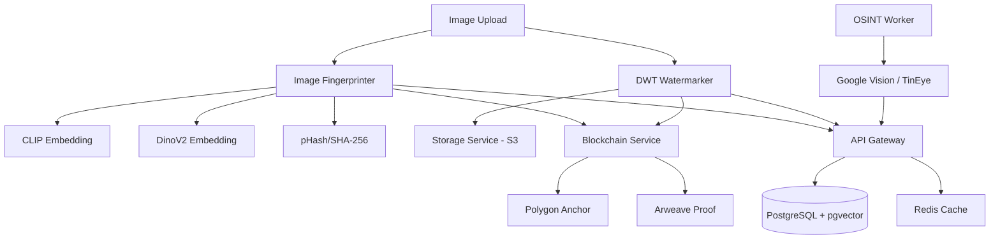

# 🛡️ PrivaStrong: Advanced Image Provenance & Digital Self-Defense

[](https://opensource.org/licenses/Apache-2.0)
[](https://www.python.org/downloads/release/python-3110/)
[](http://makeapullrequest.com)

**PrivaStrong** is an enterprise-grade, open-source image provenance engine designed to protect individuals from non-consensual image distribution and cyber-harassment. It combines frequency-domain watermarking, multi-model AI embeddings, and public blockchain anchoring to create a "Digital Receipt" for every image that survives cropping, compression, and screenshots.

---

## 🕯️ The Mission: Why PrivaStrong?

This project was born out of a necessity to fight back against the devastating effects of **cyber-harassment**. 

When a personal image is leaked or spread without consent, victims often find themselves in a state of powerlessness. Existing platforms often fail to provide the tools necessary to prove ownership once metadata is stripped or an image is edited.

**PrivaStrong is built to be a shield.** It provides the technical proof required to hold leakers accountable and gives individuals ownership over their digital identity. 

### 🌸 A Dedication
> *I built this project to save people and ensure that technology is used for ethical purposes only. This work is dedicated to my sisters and my mother. **Happy Mother's Day.** May we build a world where tech protects the vulnerable rather than hurting them.*

---

## 🚀 Key Features

### 1. Robust Frequency-Domain Watermarking (DWT)
Unlike standard watermarks that can be cropped out, PrivaStrong uses **Discrete Wavelet Transform** to embed data into the image's mathematical frequencies. 
- **Resilience**: Survives JPEG compression (down to 50%), cropping, and noise.
- **Stealth**: Completely invisible to the naked eye.

### 2. Dual-Model AI Fingerprinting (CLIP + DinoV2)
Even if the watermark is destroyed by extreme distortion, our AI brain recognizes the content:
- **CLIP (OpenAI)**: Understands the semantic context of the image.
- **DinoV2 (Meta)**: Provides geometric and structural awareness, specifically tuned to survive the "Analog Hole" (taking a photo of a screen).

### 3. Public Blockchain Anchoring
Every "Upload" event is hashed and anchored to the **Polygon** and **Arweave** blockchains.
- **Verification**: Anyone can verify an image's origin using the SDK without needing access to our private database.
- **GDPR Compliant**: Uses **Salted Hashing** to allow for "link-breaking," ensuring that a user's data can be effectively removed upon request.

### 4. C2PA Standard Compliance
Implements industry-standard **Content Authenticity Initiative (CAI)** manifest signing, making PrivaStrong interoperable with the broader provenance ecosystem.

---

## 🏗️ Architecture



---

## 🛠️ Installation & Setup

### Prerequisites
- Python 3.11+
- Docker & Docker Compose
- PostgreSQL with `pgvector`
- Redis

### Quick Start (Mock Mode)
PrivaStrong comes with a "Mock Mode" enabled by default so you can test the architecture without needing expensive API keys.

1. **Clone the repository**:
   ```bash
   git clone https://github.com/Santhoshnadella/privastrong.git
   cd privastrong
   ```

2. **Set up the environment**:
   ```bash
   cp .env.example .env
   # Edit .env with your local DB credentials
   ```

3. **Launch with Docker**:
   ```bash
   docker-compose up --build
   ```

4. **Access the Dashboard**:
   Open `http://localhost:8000/dashboard` in your browser.

---

## 🤝 Collaboration & Support

### ⚠️ Current Status: Testing Pending
**Important**: The project core is 100% functional, but comprehensive real-world testing (Google Vision API, TinEye, and Mainnet Blockchain Gas) is currently **on hold due to insufficient funds**.

I am looking for:
- **Financial Sponsors**: To fund the OSINT scanning and mainnet anchoring tests.
- **Developers**: To help refine the mobile SDKs and adversarial testing scripts.
- **Cybersecurity Researchers**: To perform red-team analysis on the watermarking robustness.

**If you wish to collaborate, please open an Issue or PR!** I am happy to share this work with anyone who shares the mission of ethical technology.

---

## 📜 License
Distributed under the **Apache License 2.0**. See `LICENSE` for more information.

---
*Built with ❤️ to protect the vulnerable.*
